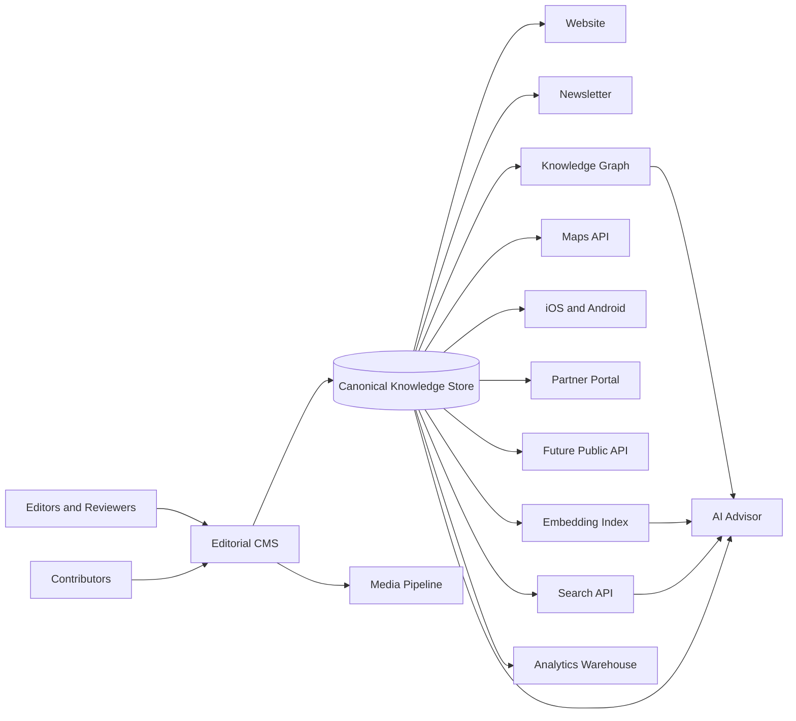
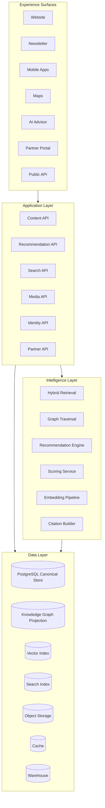

# Foundational Knowledge Platform

This architecture treats the database as the company's memory, not as a CMS.

The platform begins as an editorial publication and should be able to grow into an AI-native leisure intelligence system without rewriting the core data model.

## North Star

Every article, recommendation, review, photo, itinerary, score, place, relationship, and insight becomes canonical structured knowledge.

The website, newsletter, AI advisor, search, maps, mobile apps, partner products, and future public APIs should all consume the same source of truth.

## Architectural Principles

- Knowledge graph first, page rendering second.
- Human editorial judgment remains authoritative.
- Structured data and prose are peers, not substitutes.
- Every recommendation must preserve provenance, evidence, and confidence.
- Relationship data should be modeled explicitly rather than hidden in copy.
- AI retrieval must cite canonical records, not generated summaries alone.
- The system should prefer evolvable modular services over premature microservices.
- Editorial velocity should not compromise data quality.

## System Context

## Logical Architecture

## Core Data Strategy

Use PostgreSQL as the canonical system of record for the first several phases. It supports relational integrity, geospatial extensions, JSONB for controlled flexibility, full-text search, and pgvector for early embedding retrieval.

Project specialized systems from Postgres when scale or product requirements justify them:

- Knowledge graph projection for relationship traversal and graph analytics.
- Search index for fast editorial search, faceting, typo tolerance, and ranking.
- Vector index for semantic retrieval and LLM context assembly.
- Warehouse for analytics, attribution, cohort analysis, and business intelligence.

Postgres remains the source of truth. Projections are rebuildable.

## Repository Map

- [Domain Model](./schema/domain-model.md)
- [Editorial CMS Architecture](./cms-architecture.md)
- [Editorial Automation Workflow](./editorial-automation-workflow.md)
- [Canonical Schema](./schema/canonical-schema.sql)
- [Knowledge Graph](./schema/knowledge-graph.md)
- [Scoring System](./schema/scoring-system.md)
- [AI Retrieval Architecture](./ai-retrieval.md)
- [API Architecture](./api-architecture.md)
- [Infrastructure](./infrastructure.md)
- [Migration Strategy](./migration-strategy.md)
- [Implementation Roadmap](./roadmap/implementation-roadmap.md)
- [ADRs](./adr)
