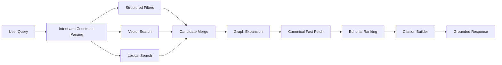

# AI Retrieval Architecture

## Goal

The AI layer should retrieve, reason over, and cite canonical editorial knowledge. It should not invent recommendations or bypass human editorial authority.

## Retrieval Modes

### Structured Retrieval

Use typed filters and relational joins for:

- Entity type
- Geography
- Season
- Price band
- Family fit
- Verification status
- Editorial verdict
- Hours and reservations
- Accessibility
- Weather dependency

### Semantic Retrieval

Use embeddings for:

- Natural-language query matching
- Taste and atmosphere similarity
- Guide and article passage retrieval
- Similar experience matching
- Fuzzy preference matching

### Lexical Search

Use search index for:

- Names
- Exact phrases
- Slugs
- Tags
- Facets
- Typo tolerance
- Editorial ranking

### Graph Traversal

Use graph traversal for:

- Nearby
- Appears in guide
- Pairs with
- Good before or after
- Belongs to
- Hidden relationships
- Multi-hop itinerary construction

## Hybrid Retrieval Pipeline

## Citation Generation

Every AI answer should preserve:

- Entity IDs
- Source content IDs
- Review IDs
- Score IDs
- Relationship IDs
- Last verification dates
- Confidence levels
- Public source snippets where allowed

The model should answer from assembled context with citations, not from embeddings alone.

## Long-Term Memory

Long-term memory should be separated into:

- Company memory: canonical editorial knowledge.
- User memory: stated preferences, saved places, past trips, family context, constraints.
- Interaction memory: recent session context.
- Model memory: derived preference signals requiring user privacy controls.

User memory must be consent-aware and erasable.

## Recommendation Engine Primitives

Required primitives:

- Nearby
- Similar
- Better than
- Hidden gem
- Worth the splurge
- Perfect for toddlers
- Perfect anniversary
- Rainy day
- Half-day
- Weekend
- Road trip
- Luxury
- Budget
- Halo Experience

Each primitive should compile into:

- Eligibility filters
- Context filters
- Relationship traversals
- Score weighting
- Explanation template
- Citation requirements

## Guardrails

- Do not recommend entities marked retired or not recommended unless the answer is explicitly explaining why.
- Do not present unverified AI inferences as editorial fact.
- Do not expose private notes to public users.
- Separate editorial confidence from AI confidence.
- Cite stale or low-confidence records clearly.
- Prefer "we do not know yet" over plausible invention.

