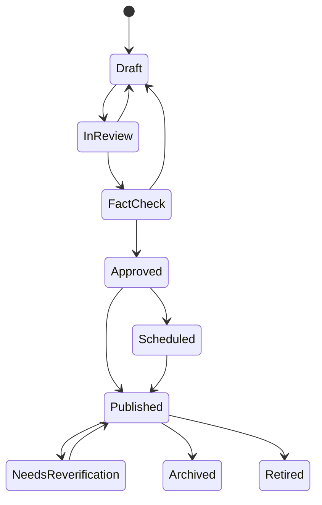

# Editorial CMS Architecture

## Purpose

The CMS is the editorial operating system for the company. It should write structured knowledge into the canonical platform, not create isolated web pages.

## Core Capabilities

Required CMS features:

- Drafts
- Publishing
- Version history
- Multiple authors
- Editorial review
- Fact check
- Scheduling
- Media management
- Tagging
- Internal linking
- SEO metadata
- Canonical URLs
- Relationship editing
- Score editing
- Verification workflows
- Public and private notes

## Workflow

## Editorial Objects

The CMS should edit:

- Articles
- Guides
- Reviews
- Itineraries
- Editorial collections
- Places
- Experiences
- Halo Experiences
- Scores
- Relationships
- Media

## Versioning

Version snapshots should capture:

- Structured fields
- Rich body content
- Relationships changed during edit
- Scores changed during edit
- SEO fields
- Media usage
- Author/editor metadata
- Change reason

Published versions should be recoverable even if the current draft changes.

## Media Management

The CMS should support:

- Uploads
- Rights metadata
- Captions
- Credits
- Alt text
- Cropping
- Renditions
- Gallery assembly
- Entity association
- Location metadata

No media asset should be publishable without rights status and alt text review.

## Internal Linking

Internal links should prefer canonical entity references over hardcoded URLs.

When a linked entity slug changes, the URL layer should update without breaking the underlying relationship.

## SEO

SEO fields:

- Canonical URL
- Title tag
- Meta description
- Open Graph title
- Open Graph description
- Social image
- Structured data
- Sitemap inclusion
- Robots directives

SEO should support discovery, but it should not drive editorial strategy.

## Access Control

CMS roles:

- Contributor
- Writer
- Reviewer
- Editor
- Managing editor
- Photo editor
- Admin

Permissions should be policy-based and object-aware.

Examples:

- Contributors can submit drafts but not publish.
- Photo editors can modify media metadata.
- Editors can approve scores and recommendations.
- Admins can change workflow policy and user roles.

