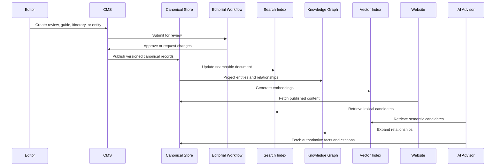
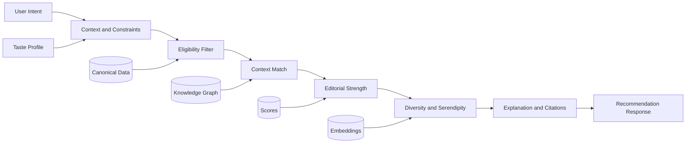
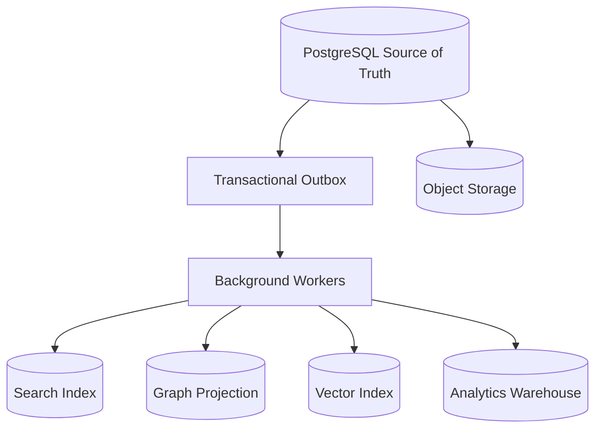

# Platform Flow Diagrams

## Content To Knowledge Flow

```mermaid
sequenceDiagram
  participant Editor
  participant CMS
  participant Canonical as Canonical Store
  participant Workflow as Editorial Workflow
  participant Search as Search Index
  participant Graph as Knowledge Graph
  participant Vector as Vector Index
  participant Web as Website
  participant AI as AI Advisor

  Editor->>CMS: Create review, guide, itinerary, or entity
  CMS->>Workflow: Submit for review
  Workflow->>CMS: Approve or request changes
  CMS->>Canonical: Publish versioned canonical records
  Canonical->>Search: Update searchable document
  Canonical->>Graph: Project entities and relationships
  Canonical->>Vector: Generate embeddings
  Web->>Canonical: Fetch published content
  AI->>Search: Retrieve lexical candidates
  AI->>Vector: Retrieve semantic candidates
  AI->>Graph: Expand relationships
  AI->>Canonical: Fetch authoritative facts and citations
```

## Recommendation Flow

```mermaid
flowchart LR
  Intent[User Intent] --> Constraints[Context and Constraints]
  Profile[Taste Profile] --> Constraints
  Constraints --> Eligibility[Eligibility Filter]
  Eligibility --> ContextMatch[Context Match]
  ContextMatch --> EditorialStrength[Editorial Strength]
  EditorialStrength --> Diversity[Diversity and Serendipity]
  Diversity --> Explanation[Explanation and Citations]
  Explanation --> Recommendation[Recommendation Response]

  Canonical[(Canonical Data)] --> Eligibility
  Graph[(Knowledge Graph)] --> ContextMatch
  Scores[(Scores)] --> EditorialStrength
  Embeddings[(Embeddings)] --> Diversity
```

## Data Projection Flow

```mermaid
flowchart TB
  Postgres[(PostgreSQL Source of Truth)]
  Outbox[Transactional Outbox]
  Workers[Background Workers]
  Search[(Search Index)]
  Graph[(Graph Projection)]
  Vector[(Vector Index)]
  Warehouse[(Analytics Warehouse)]
  Object[(Object Storage)]

  Postgres --> Outbox
  Outbox --> Workers
  Workers --> Search
  Workers --> Graph
  Workers --> Vector
  Workers --> Warehouse
  Postgres --> Object
```

