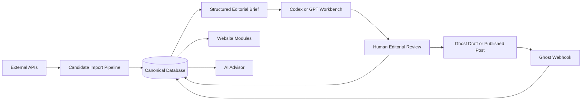

# Editorial Automation Workflow

## Goal

Make the platform as automated as possible without confusing automation with editorial authority.

Codex or GPT should be the editorial workbench where briefs, reviews, guides, recommendations, and structured data are drafted. Ghost should publish finished editorial content. The canonical database should preserve the structured memory behind the content.

## Operating Model



## What Should Be Automated

Automate:

- Place discovery from APIs such as Google Places.
- Address, coordinates, website, phone, opening hours, and Google place ID ingestion.
- Candidate hotel, restaurant, coffee, park, museum, and experience creation.
- Deduplication suggestions.
- Affiliate provider matching.
- Booking link creation where provider terms allow it.
- Price snapshot collection where partner APIs allow it.
- Draft editorial briefs.
- Draft structured scores with low confidence labels.
- Draft relationship suggestions.
- Draft Ghost posts.
- Internal link suggestions.
- Reverification reminders.

Do not fully automate:

- Final recommendation verdicts.
- Halo scores.
- Taste claims.
- Family-fit claims.
- "Best" rankings.
- Negative claims about properties.
- Final public caveats.

## Big Sur Example Flow

### 1. Import Candidate Universe

Run an import for:

- Hotels in Big Sur
- Restaurants in Big Sur
- Coffee shops in Big Sur
- Parks and trails near Big Sur
- Viewpoints along Highway 1

Imported records should be marked:

```text
editorial_status = candidate
verification_status = external_source_imported
recommendation_status = not_yet_reviewed
```

### 2. Generate A Structured Brief

The system creates a Big Sur brief for Codex/GPT:

```text
Destination: Big Sur
Working article: Best Family Hotels in Big Sur
Candidate hotels:
- Post Ranch Inn
- Alila Ventana Big Sur
- Big Sur Lodge
- Glen Oaks Big Sur
- Deetjen's Big Sur Inn

Known source data:
- Address
- Coordinates
- Website
- Google place ID
- Public rating where legally displayable
- Hours or business status where available
- Affiliate availability where matched

Editorial questions:
- Which are actually suitable for families?
- Which are better for couples?
- Which are worth the splurge?
- Which require caveats?
- Which should not be recommended yet?
```

### 3. Draft In Codex Or GPT

Codex/GPT should produce two artifacts:

1. Structured data patch:

```yaml
entities:
  - type: hotel
    slug: post-ranch-inn
    name: Post Ranch Inn
    editorial_status: needs_review
    recommendation:
      verdict: recommended_with_caveats
      best_for:
        - design-focused travelers
        - milestone trips
      caveats:
        - Verify current child policy before positioning as family-first.
    scores:
      beauty_score: 96
      luxury_score: 95
      family_score: 45
      confidence_score: 60
    relationships:
      - type: belongs_to
        target: region:big-sur
      - type: worth_the_splurge
        target: occasion:milestone_trip
```

2. Ghost-ready editorial draft:

```markdown
# Best Family Hotels in Big Sur

Big Sur is not a simple family destination. It is dramatic, beautiful, expensive, and sometimes logistically awkward with young children. That makes judgment more important than a generic hotel list.

...
```

### 4. Human Review

The editor reviews:

- Factual fields
- Family-fit claims
- Scores
- Caveats
- Verdicts
- Affiliate disclosures
- Whether each candidate deserves inclusion

Only reviewed recommendations become public.

### 5. Publish To Ghost

Ghost receives:

- Title
- Slug
- Markdown or rich content
- Tags
- Authors
- SEO metadata
- Canonical entity references embedded as shortcodes or structured blocks

Example internal block:

```text
{{canonical-hotel-card slug="post-ranch-inn"}}
```

The site renderer can replace this with live canonical data:

- Current summary
- Scores
- Caveats
- Booking links
- Map pin
- Related recommendations

### 6. Sync Back From Ghost

Ghost webhooks update:

- Ghost post ID
- Ghost slug
- Publication status
- Published date
- Updated date
- Canonical content relationships

Ghost is the publishing surface. The canonical database remains the memory.

## Data Entry Modes

### Mode 1: Import First

Best for destinations.

```text
External API -> Candidate records -> Codex/GPT brief -> Human review -> Ghost article
```

### Mode 2: Editorial First

Best for essays, reported pieces, and opinionated guides.

```text
Codex/GPT draft -> Extract entities and relationships -> Human review -> Canonical DB -> Ghost
```

### Mode 3: Experience First

Best for Halo Experiences.

```text
Human concept -> Codex/GPT structured brief -> Related entity matching -> Review -> Canonical DB -> Ghost
```

## Minimum Automation Components

Build these early:

- `import_places` job for external place APIs.
- `match_affiliates` job for booking and affiliate providers.
- `generate_editorial_brief` job for Codex/GPT.
- `apply_structured_patch` job for reviewed YAML or JSON patches.
- `create_ghost_draft` job.
- `sync_ghost_webhooks` job.
- `reverify_entities` job.

## Trust Controls

Every automated field needs:

- Source
- Imported at
- Last refreshed at
- Confidence
- Display permission
- Review status

Every AI-generated field needs:

- Prompt/input reference
- Model
- Created at
- Reviewer
- Accepted/rejected status

## Recommended First Build

The first implementation should support:

1. Import hotels for one destination.
2. Generate a structured Big Sur editorial brief.
3. Let Codex/GPT draft structured recommendations and Ghost prose.
4. Save reviewed structured patches into the canonical database.
5. Create or update a Ghost draft.

That is enough to establish the repeatable operating system.

